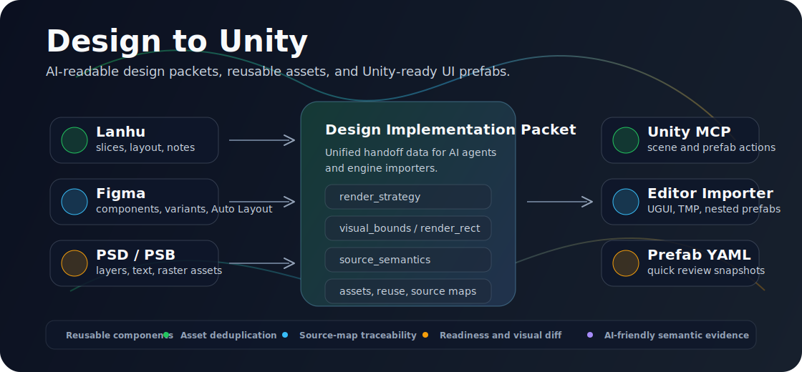

# Design to Unity

[GitHub 仓库](https://github.com/Crackerrrrrr/design-to-unity) · `Crackerrrrrr/design-to-unity`

<p align="center">
  
</p>

Design to Unity 是一个面向游戏 UI 落地的 MCP 服务。它可以把蓝湖设计稿、Figma 文件、PSD / PSB 文件，以及 Photoshop / UXP 导出物转换成结构化的设计实现数据包、资源清单和 Unity 可导入的 UGUI 预制体 YAML 快照。

针对 Figma 工作流，它可以读取在线 Figma 文件、Frame、Component、Instance、本地 JSON snapshot 或插件导出物，保留 Auto Layout、constraints、文本、图片填充、组件关系、variants、variables、prototype reactions 和复杂视觉风险信息，再输出给 Unity MCP、静态 prefab YAML 或 Unity Editor importer 继续落地。

它的核心目标不是替代 Unity 编辑器，而是给 AI 和 Unity MCP 提供足够完整、低歧义的设计信息，让设计稿可以更稳定地复原为可检查、可继续加工的 Unity UI。

## 我们的优势

| 优势 | 对项目落地的价值 |
| --- | --- |
| 统一设计数据包 | 蓝湖、Figma、PSD / PSB 和插件导出物都会进入同一套 AI 可读 packet，避免每个来源单独维护一套转换逻辑。 |
| AI 更容易理解设计 | 每个关键节点都能暴露坐标、文本、资源、组件提示、渲染策略、语义来源、置信度和判断原因。 |
| 面向 Unity，但不被 Unity 绑定 | 中间层保持跨引擎可复用，Unity 侧再输出 prefab YAML、source map、TMP 文本、UGUI hint 和 Editor importer。 |
| 默认考虑复用和去重 | 通过图片 hash、Figma imageRef、组件 key、reusable prefab、variant 和 9-slice hint，减少重复资源和重复搭 UI。 |
| 更适合持续迭代 | readiness report、source map、增量导入保护和 visual diff 让生成结果更容易检查、更新和回归。 |
| 专门面向游戏 UI | Button、Slider、Toggle、ScrollView、List、Tab、Input、Dropdown、LayoutGroup、Mask、Canvas 等 UI 语义是一等能力。 |

## 主要能力

- 解析蓝湖项目和设计页
- 通过 Figma REST API 或本地 JSON snapshot 解析 Figma 文件、Frame 和组件
- 批量准备 Figma page / component library 的 packet，并批量写出 Unity prefab YAML
- 读取 Figma 插件导出的 selection、预览图、手动语义标记和复杂视觉资源
- 读取本地 PSD / PSB 文件
- 读取 Photoshop UXP 导出的 `design.json`、`preview.png` 和图层资源
- 输出设计节点树、坐标、文本、样式、资源和语义提示
- 将 Figma Auto Layout 的 padding、spacing、child alignment、control、expand 和子节点 LayoutElement hint 写入 YAML / Editor importer 输出
- 为每个节点输出 `render_strategy`、`visual_bounds` / `render_rect` 和 `source_semantics`
- 下载和整理设计资源、切图资源
- 为资源生成 `content_hash`，相同图片在 Unity 输出时只导入一份
- 生成 `reusable_prefabs` 复用注册表，标记重复按钮、Tab、Slider 等组件的 definition / instance 关系
- 将 Figma component variant 属性暴露为 reusable prefab 的 instance override 和 Unity prefab variant 候选
- 从 Figma 圆角 / 描边推导按钮、面板、卡片等可拉伸 UI 的 `nine_slice_hint.border`
- 可选读取 Figma variables，并标准化为 Unity theme / token 可消费的 design tokens
- 保留 Figma prototype reactions，并转换为 Unity navigation / event hints
- 将 Figma constraints 转成 Unity RectTransform anchor hint，并在 YAML / Editor importer 输出中生效
- 将 Figma blur、blend mode、渐变 / 多 fill、mask 风险写入 source semantics、visual bounds 和 readiness report
- Figma 插件导出器会导出 constraints、Auto Layout 子节点尺寸、组件 variant、prototype reactions、rich text override 元数据，并触发复杂视觉节点切图
- 生成 Unity handoff plan
- 直接写出静态 UGUI prefab YAML
- 生成 prefab source map，保留设计节点到 Unity 组件的映射
- 提供静态 prefab YAML 校验
- 可安装 Unity Editor validator 脚本做导入后检查
- 支持 Unity 截图和设计参考图的视觉差异比较

## Figma 到 Unity 工作流

Figma 支持不是简单截图还原，而是把设计文件转成 AI 和 Unity 都能理解的实现计划：

- REST API 模式读取在线 Figma 文件、页面、Frame、组件、样式、variables、图片填充和导出地址。
- Snapshot 模式支持离线回归测试，不依赖实时网络和 Figma 权限。
- 插件导出模式可以捕获当前选区、预览 PNG、人工语义标记，以及需要切图兜底的复杂 Vector / 图片资源。
- Packet 会保留 `render_strategy`、`render_rect`、`visual_bounds`、`source_semantics`、Auto Layout、constraints、文本元数据和 reusable prefab 候选。
- Unity 侧既可以快速写出静态 prefab YAML，也可以通过 `DesignToUnityPrefabImporter.cs` 使用 Editor API 创建 prefab、可复用 definition、nested instance 和 variant prefab asset。

## 支持的 Unity UI 组件提示

- `Image`
- `TextMeshProUGUI`
- `Outline`
- `Shadow`
- `Button`
- `Slider`
- `Toggle`
- `ToggleGroup`
- `TMP_InputField`
- `TMP_Dropdown`
- `ScrollRect`
- `Scrollbar`
- `RectMask2D`
- `VerticalLayoutGroup`
- `HorizontalLayoutGroup`
- `GridLayoutGroup`
- `CanvasGroup`

## 快速开始

```bash
python -m venv .venv
source .venv/bin/activate
pip install -e .
cp .env.example .env
```

如果需要访问蓝湖或 Figma，在 `.env` 中配置：

```bash
LANHU_COOKIE=你的蓝湖 Cookie
FIGMA_TOKEN=你的 Figma Personal Access Token
```

启动 HTTP MCP 服务：

```bash
DesignToUnity
```

如果 MCP 客户端使用 stdio：

```bash
MCP_TRANSPORT=stdio DesignToUnity
```

## 蓝湖工具

- `lanhu_design_list`
- `lanhu_design_prepare_packet`
- `lanhu_design_get_packet`
- `lanhu_design_get_summary`
- `lanhu_design_get_node_tree`
- `lanhu_design_get_node_detail`
- `lanhu_design_get_asset_manifest`
- `lanhu_design_get_slices`
- `lanhu_design_get_unity_plan`
- `lanhu_design_get_handoff_profile`
- `lanhu_design_write_unity_prefab_yaml`
- `lanhu_design_verify_unity_prefab_yaml`

## Figma 工具

- `figma_design_list_pages`
- `figma_design_list_frames`
- `figma_design_list_components`
- `figma_design_list_variables`
- `figma_design_get_export_schema`
- `figma_design_validate_export`
- `figma_design_prepare_packet`
- `figma_design_prepare_batch_packets`
- `figma_design_prepare_export_packet`
- `figma_design_export_assets`
- `figma_design_prepare_snapshot_packet`
- `figma_design_prepare_batch_snapshot_packets`
- `figma_design_get_component_usage`
- `figma_design_get_packet`
- `figma_design_get_summary`
- `figma_design_get_node_tree`
- `figma_design_get_node_detail`
- `figma_design_get_asset_manifest`
- `figma_design_get_slices`
- `figma_design_get_unity_plan`
- `figma_design_get_unity_readiness_report`
- `figma_design_compare_unity_screenshot`
- `figma_design_write_unity_prefab_yaml`
- `figma_design_write_batch_unity_prefab_yaml`
- `figma_design_verify_unity_prefab_yaml`
- `figma_design_convert_to_unity_prefab`
- `figma_design_convert_export_to_unity_prefab`
- `figma_design_install_unity_editor_importer`

## Unity Editor Importer

- `design_to_unity_install_unity_editor_importer`

这个工具会把 `Assets/Editor/DesignToUnity/DesignToUnityPrefabImporter.cs` 安装到 Unity 项目中。Importer 会读取生成的 `*.design-to-unity.json` source map，通过 Unity Editor API 创建 UGUI prefab，并支持基础 TMP 文本、Image、Button、Slider、Toggle、ScrollRect、LayoutGroup、reusable prefab definition / nested instance 输出，以及 Figma variant prefab asset 输出。

安装后可以在 Unity 菜单中使用：

```text
Tools/Design To Unity/Import Prefab From Source Map
```

也可以用 batchmode：

```bash
Unity -batchmode \
  -projectPath /path/to/UnityProject \
  -executeMethod DesignToUnityPrefabImporter.ImportFromCommandLine \
  -d2uSourceMap Assets/DesignToUnity/<packet>/Prefabs/<name>.design-to-unity.json \
  -d2uOutputPrefab Assets/DesignToUnity/<packet>/Prefabs/<name>.editor-imported.prefab \
  -d2uIncremental true \
  -d2uReport Assets/DesignToUnity/<packet>/Prefabs/<name>.import-report.json
```

当使用 `-d2uIncremental true` 且输出 prefab 已存在时，Importer 会按 source map 里的 `unity_path` 匹配已有对象，更新设计拥有字段，创建新增节点，并默认保留没有匹配到的已有子节点。在替换 reusable prefab 时，用户新增的子物体会迁移到新的 nested prefab instance；如果 source-owned 节点上存在自定义组件或持久化事件绑定，则会跳过替换并写入保护报告。生成的 import report 会记录 created、updated、preserved、protected、reusable prefab definition、reused prefab instance 和 prefab variant 数量。

批量导入 page / component library 时可以用：

```bash
Unity -batchmode \
  -projectPath /path/to/UnityProject \
  -executeMethod DesignToUnityPrefabImporter.ImportFromCommandLine \
  -d2uSourceMaps "Assets/DesignToUnity/a/Prefabs/a.design-to-unity.json;Assets/DesignToUnity/b/Prefabs/b.design-to-unity.json" \
  -d2uOutputDir Assets/DesignToUnity/ImportedPrefabs \
  -d2uIncremental true \
  -d2uBatchReport Assets/DesignToUnity/import-batch-report.json
```

也可以传 `-d2uSourceMapDir Assets/DesignToUnity` 批量导入目录下所有 `*.design-to-unity.json`，或用 `-d2uOutputPrefabs` 给每个 source map 指定明确输出 prefab。

## TMP 字体映射

Figma / PSD 文本默认会生成可编辑 `TextMeshProUGUI`。可以通过工具参数 `tmp_font_asset_guid` / `tmp_font_asset_map_json` 指定 TMP 字体，也可以在 `.env` 中配置默认值：

```env
UNITY_TMP_FONT_ASSET_GUID=
UNITY_TMP_FONT_ASSET_MAP_JSON={"figma_font_to_tmp":{"Inter":"11111111111111111111111111111111"}}
UNITY_TMP_FONT_ASSET_MAP_PATH=/path/to/font-map.json
```

readiness report 会输出 `font_requirements`、`missing_tmp_font_mapping_count` 和缺失字体样例，方便在导入 Unity 前补齐映射。

## PSD / Photoshop 工具

- `psd_design_get_export_schema`
- `psd_design_validate_export`
- `psd_design_prepare_packet`
- `psd_design_prepare_export_packet`
- `psd_design_get_summary`
- `psd_design_get_node_tree`
- `psd_design_get_node_detail`
- `psd_design_get_asset_manifest`
- `psd_design_get_slices`
- `psd_design_get_unity_plan`
- `psd_design_get_unity_readiness_report`
- `psd_design_compare_unity_screenshot`
- `psd_design_install_unity_editor_validator`
- `psd_design_write_unity_prefab_yaml`
- `psd_design_verify_unity_prefab_yaml`
- `psd_design_convert_to_unity_prefab`
- `psd_design_convert_export_to_unity_prefab`

## Figma Plugin 导出器

仓库内置一个 Figma 插件导出器模板：

```text
templates/figma-plugin-exporter
```

它可以把当前选中的 Frame / Component 导出成单个 `*-design-to-unity.json`，其中包含节点树、预览图、手动语义标记和复杂 Vector / 图片资源的 base64 数据。导出后可以通过 `figma_design_prepare_export_packet` 读取，也可以通过 `figma_design_convert_export_to_unity_prefab` 直接转换为 Unity prefab。

## Photoshop UXP 导出器

仓库内置一个 Photoshop UXP 导出器模板：

```text
templates/photoshop-uxp-exporter
```

它可以导出：

- `design.json`
- `preview.png`
- 图层 PNG 资源
- Photoshop 可暴露的可编辑文本信息
- 复杂分组的 rasterize 标记

导出后可以通过 `psd_design_prepare_export_packet` 读取，也可以通过 `psd_design_convert_export_to_unity_prefab` 直接转换为 Unity prefab。

## 复用与去重

每个 packet 都会额外生成两层复用信息：

- 资源层：图片资源带 `content_hash` / `file_hash`，Figma 图片填充还会保留 `source_image_ref` / `image_fill` / `source_image_fill_url`。直接写 Unity YAML 时，相同内容、同一 Figma imageRef 或同一远端来源的图片只复制一次，其他资源会通过 `duplicate_of` / `deduped_unity_asset_path` 指向同一份 Unity Sprite。
- 节点层：组件节点带 `reusable_prefab_key` 和 `reusable_prefab`。packet 顶层的 `reusable_prefabs` 会列出可复用组件组，包含 `definition_node_id`、`instance_node_ids`、建议 prefab 路径和实例覆盖字段。
- Variant 层：Figma component variant 会汇总到 `prefab_variant_groups`，包含 base prefab 路径、variant axes、variant node id 和建议的 Unity prefab variant asset 路径。
- 9-slice 层：Figma 图片/复杂节点如果是按钮、面板、卡片等可拉伸 UI，并带圆角或描边，会自动生成 `nine_slice_hint.border`，Unity YAML writer 会写入 Sprite `spriteBorder`。

Unity MCP 可以按 `reusable_prefabs` 的顺序先把 definition 节点保存成 prefab，再把其他 instance 节点实例化出来，并应用位置、文字等 override；随后读取 `prefab_variant_groups` 创建状态对应的 prefab variant。当前实验性的直接 YAML writer 仍会展开完整静态层级；Unity Editor importer 会根据 source map 保存 reusable definition、创建 variant prefab asset，并把后续 instance 替换成真正的嵌套 prefab instance。

## Direct Unity Prefab YAML

直接写 prefab 时会生成：

- Unity `Assets/...` 目录下的资源副本
- 稳定 GUID 的 `.png.meta`
- `.prefab` YAML 文件
- 同目录 `*.design-to-unity.json` source map
- 必要的 `.prefab.meta`

这条路径适合静态 UI 还原、prefab review 和 AI 后续加工。业务脚本、动画绑定、运行时数据绑定和项目自定义逻辑应继续在 Unity 中完成。
