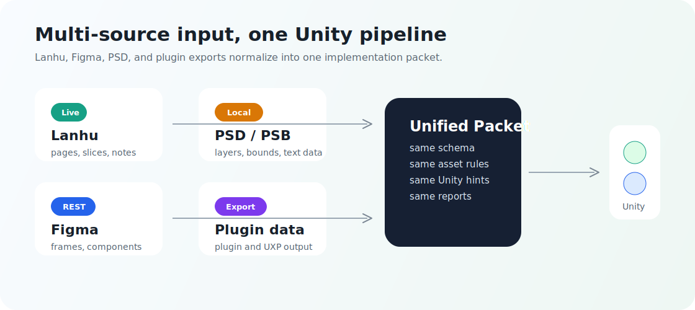
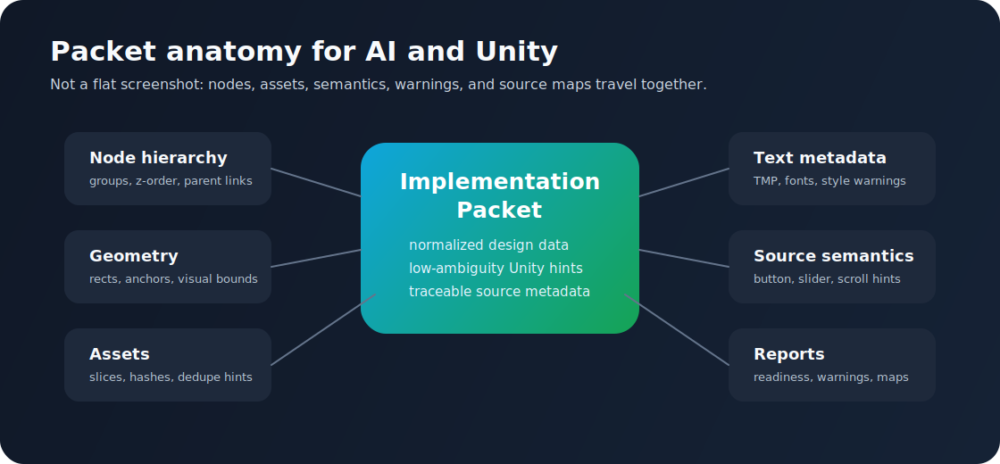
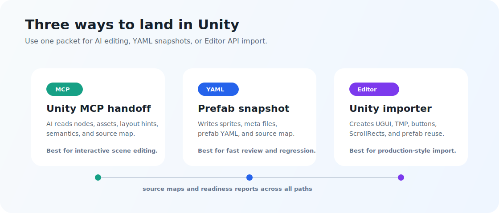

# Design to Unity

<!-- mcp-name: io.github.crackerrrrrr/design-to-unity -->

[English README](README.md) · [GitHub 仓库](https://github.com/Crackerrrrrr/design-to-unity) · `Crackerrrrrr/design-to-unity`

<p align="center">
  
</p>

Design to Unity 是一个面向游戏 UI 落地的 MCP 服务。它可以把蓝湖、Figma、PSD / PSB，以及 Photoshop UI 设计稿转换成结构化实现数据包、可下载资源和 Unity 可导入的 UGUI prefab 输出。

它不是让 AI 看一张截图然后猜 UI，而是把设计稿里的真实结构暴露出来：节点、边界、文字、切图、可复用组件、渲染策略、来源语义、风险提示和 Unity 导入提示。这样 AI、Unity MCP 或 Unity Editor importer 才能更稳定地把设计稿复原为可检查、可继续加工的 Unity UI。

## 一眼看懂

| 问题 | 回答 |
| --- | --- |
| 它读取什么？ | 蓝湖页面、Figma 文件、Figma 插件导出物、PSD / PSB 文件、Photoshop UXP 导出物。 |
| 它输出什么？ | 统一 Design Implementation Packet、资源清单、source map、readiness report、prefab YAML、Unity Editor importer 输入。 |
| 适合谁？ | 游戏团队、技术美术、Unity 开发、以及需要可靠 UI 复原信息的 AI Agent。 |
| 它替代 Unity 吗？ | 不替代。它负责准备低歧义设计信息和可选 prefab 快照，后续由 Unity MCP 或 Unity 编辑器工具继续落地。 |
| 它只是截图还原吗？ | 不是。参考图只用于最终对比，布局应来自节点、资源、文字和 source metadata。 |

## 你会得到什么

- 一套跨蓝湖、Figma、PSD / PSB 和插件导出物的统一 AI 可读 packet。
- 每个节点的几何、层级、资源引用、文本元数据、语义候选和 Unity RectTransform hint。
- `Button`、`Slider`、`Toggle`、`ScrollRect`、`Scrollbar`、`TMP_InputField`、`TMP_Dropdown`、Mask、LayoutGroup 等组件提示。
- 基于 content hash、Figma imageRef、reusable prefab candidate 的资源去重和复用提示。
- 默认可编辑 TMP 文本；当来源字体缺少 TMP 映射时，readiness report 会反馈给用户。
- 可直接写出静态 UGUI prefab YAML，用于快速检查。
- 可生成 Unity Editor importer 输入，用 Editor API 创建 prefab、reusable definition、nested instance 和 variant prefab asset。
- source map、readiness report、validator 和 visual diff 辅助，方便检查和回归。

## 设计源覆盖

<p align="center">
  
</p>

| 来源 | Design to Unity 会保留的信息 |
| --- | --- |
| 蓝湖 | 项目页面、设计页结构、切图资源、节点位置、文本、交付标注，以及 Unity 布局和组件提示。 |
| Figma | 文件、Frame、Component、插件导出、Auto Layout、constraints、图片填充、variants、variables、prototype reactions 和视觉风险信息。 |
| PSD / PSB | 图层树、边界、可编辑文本元数据、混合和特效风险、分组资源，以及必要的切图兜底。 |
| Photoshop UXP 导出 | `design.json`、`preview.png`、图层 PNG、文本元数据、语义标记和复杂分组 rasterize 提示。 |
| Unity 输出 | 跨引擎 packet、资源清单、reusable prefab 注册表、source map、UGUI prefab YAML、readiness report 和 Editor importer 输入。 |

## Packet 结构

<p align="center">
  
</p>

Design Implementation Packet 是稳定的中间层。它保留各设计源的意图，同时给 AI 和 Unity 一套统一结构：

| Packet 区域 | 价值 |
| --- | --- |
| `nodes` | 保留层级、z-order、命名、父子关系和节点类型。 |
| `global_rect` / `local_rect` / `unity_rect_hint` | 给 Unity 提供可预测的位置、尺寸、pivot 和 anchor hint。 |
| `render_strategy` | 说明节点应该作为文本、图片、分组、整组切图或组件候选落地。 |
| `render_rect` / `visual_bounds` | 处理阴影、描边、特效等超出布局边界的视觉区域。 |
| `source_semantics` | 保存组件推断、命名依据、布局推断、置信度和 review 标记。 |
| `asset_manifest` | 列出 Sprite、hash、重复资源、Unity 路径和导入提示。 |
| `reusable_prefabs` | 标记重复按钮、Tab、Slider、列表项等可复用 UI 结构。 |
| `source_map` | 追踪设计节点到 Unity 对象和组件，支持检查和增量导入。 |
| `readiness_report` | 暴露缺失资源、缺失 TMP 映射、复杂视觉、低置信度语义和下一步建议。 |

## Unity 落地方式

<p align="center">
  
</p>

Design to Unity 支持三种 Unity 落地路径：

| 路径 | 适合什么时候使用 |
| --- | --- |
| Unity MCP handoff | AI Agent 需要读取 packet，并在 Unity 中交互式创建或调整对象。 |
| Direct prefab YAML | 需要快速生成静态 UGUI prefab 快照，用于 review、diff 或回归。 |
| Unity Editor importer | 需要通过 Unity Editor API 创建 UGUI 对象、TMP 文本、reusable definition、nested instance 和 variant prefab。 |

## 快速开始

```bash
python -m venv .venv
source .venv/bin/activate
pip install -e .
cp .env.example .env
```

只有需要访问在线蓝湖或 Figma 时，才需要在 `.env` 中配置凭据：

```bash
LANHU_COOKIE=你的蓝湖 Cookie
FIGMA_TOKEN=你的 Figma Personal Access Token
```

启动 HTTP MCP 服务：

```bash
DesignToUnity
```

如果 MCP 客户端使用 stdio：

```bash
MCP_TRANSPORT=stdio DesignToUnity
```

## 常用流程

### 蓝湖到 Unity

```text
lanhu_design_list
lanhu_design_prepare_packet
lanhu_design_get_summary
lanhu_design_get_unity_plan
lanhu_design_write_unity_prefab_yaml
lanhu_design_verify_unity_prefab_yaml
```

适合在线蓝湖页面。Unity 结果应由切图、节点位置、文本和布局标注驱动，参考图只用于最终对比。

### Figma 到 Unity

```text
figma_design_list_pages / figma_design_list_frames
figma_design_prepare_packet
figma_design_get_component_usage
figma_design_get_unity_readiness_report
figma_design_write_unity_prefab_yaml
figma_design_install_unity_editor_importer
```

适合带 Auto Layout、constraints、组件、variant、图片填充和 prototype metadata 的 Figma 文件。

### PSD / Photoshop 到 Unity

```text
psd_design_prepare_packet
psd_design_get_unity_readiness_report
psd_design_write_unity_prefab_yaml
psd_design_verify_unity_prefab_yaml
```

适合本地 PSD / PSB 文件或 Photoshop UXP 导出目录。如果需要更完整的文本、图层和复杂分组信息，建议使用 UXP 导出器补充原始 PSD 解析。

## 工具参考

### 蓝湖工具

- `lanhu_design_list`
- `lanhu_design_prepare_packet`
- `lanhu_design_get_packet`
- `lanhu_design_get_summary`
- `lanhu_design_get_node_tree`
- `lanhu_design_get_node_detail`
- `lanhu_design_get_asset_manifest`
- `lanhu_design_get_slices`
- `lanhu_design_get_unity_plan`
- `lanhu_design_get_handoff_profile`
- `lanhu_design_write_unity_prefab_yaml`
- `lanhu_design_verify_unity_prefab_yaml`

### Figma 工具

- `figma_design_list_pages`
- `figma_design_list_frames`
- `figma_design_list_components`
- `figma_design_list_variables`
- `figma_design_get_export_schema`
- `figma_design_validate_export`
- `figma_design_prepare_packet`
- `figma_design_prepare_batch_packets`
- `figma_design_prepare_export_packet`
- `figma_design_export_assets`
- `figma_design_prepare_snapshot_packet`
- `figma_design_prepare_batch_snapshot_packets`
- `figma_design_get_component_usage`
- `figma_design_get_packet`
- `figma_design_get_summary`
- `figma_design_get_node_tree`
- `figma_design_get_node_detail`
- `figma_design_get_asset_manifest`
- `figma_design_get_slices`
- `figma_design_get_unity_plan`
- `figma_design_get_unity_readiness_report`
- `figma_design_compare_unity_screenshot`
- `figma_design_write_unity_prefab_yaml`
- `figma_design_write_batch_unity_prefab_yaml`
- `figma_design_verify_unity_prefab_yaml`
- `figma_design_convert_to_unity_prefab`
- `figma_design_convert_export_to_unity_prefab`
- `figma_design_install_unity_editor_importer`

### PSD / Photoshop 工具

- `psd_design_get_export_schema`
- `psd_design_validate_export`
- `psd_design_prepare_packet`
- `psd_design_prepare_export_packet`
- `psd_design_get_summary`
- `psd_design_get_node_tree`
- `psd_design_get_node_detail`
- `psd_design_get_asset_manifest`
- `psd_design_get_slices`
- `psd_design_get_unity_plan`
- `psd_design_get_unity_readiness_report`
- `psd_design_compare_unity_screenshot`
- `psd_design_install_unity_editor_validator`
- `psd_design_write_unity_prefab_yaml`
- `psd_design_verify_unity_prefab_yaml`
- `psd_design_convert_to_unity_prefab`
- `psd_design_convert_export_to_unity_prefab`

### 通用 Unity 工具

- `design_to_unity_install_unity_editor_importer`

## Unity Editor Importer

`design_to_unity_install_unity_editor_importer` 会安装：

```text
Assets/Editor/DesignToUnity/DesignToUnityPrefabImporter.cs
```

Importer 会读取生成的 `*.design-to-unity.json` source map，通过 Unity Editor API 创建 UGUI prefab。它支持基础 TMP 文本、Image、Button、Slider、Toggle、ScrollRect、LayoutGroup、reusable prefab definition / nested instance 输出，以及 Figma variant prefab asset。

安装后可以在 Unity 菜单中使用：

```text
Tools/Design To Unity/Import Prefab From Source Map
```

也可以用 batchmode：

```bash
Unity -batchmode \
  -projectPath /path/to/UnityProject \
  -executeMethod DesignToUnityPrefabImporter.ImportFromCommandLine \
  -d2uSourceMap Assets/DesignToUnity/<packet>/Prefabs/<name>.design-to-unity.json \
  -d2uOutputPrefab Assets/DesignToUnity/<packet>/Prefabs/<name>.editor-imported.prefab \
  -d2uIncremental true \
  -d2uReport Assets/DesignToUnity/<packet>/Prefabs/<name>.import-report.json
```

批量导入 page 或 component library 时可以用：

```bash
Unity -batchmode \
  -projectPath /path/to/UnityProject \
  -executeMethod DesignToUnityPrefabImporter.ImportFromCommandLine \
  -d2uSourceMaps "Assets/DesignToUnity/a/Prefabs/a.design-to-unity.json;Assets/DesignToUnity/b/Prefabs/b.design-to-unity.json" \
  -d2uOutputDir Assets/DesignToUnity/ImportedPrefabs \
  -d2uIncremental true \
  -d2uBatchReport Assets/DesignToUnity/import-batch-report.json
```

也可以传 `-d2uSourceMapDir Assets/DesignToUnity` 批量导入目录下所有 `*.design-to-unity.json`，或用 `-d2uOutputPrefabs` 给每个 source map 指定明确输出 prefab。

当使用 `-d2uIncremental true` 且输出 prefab 已存在时，Importer 会按 source map 里的 `unity_path` 匹配已有对象，更新设计拥有字段，创建新增节点，并默认保留没有匹配到的已有子节点。在替换 reusable prefab 时，用户新增的子物体会迁移到新的 nested prefab instance；如果 source-owned 节点上存在自定义组件或持久化事件绑定，则会跳过替换并写入保护报告。

## TMP 文本与字体映射

Figma、PSD 和蓝湖文本默认生成可编辑 `TextMeshProUGUI`。缺少 TMP 字体时，工具会报告问题，而不是静默把文字转成图片。

可以通过工具参数 `tmp_font_asset_guid` / `tmp_font_asset_map_json` 指定 TMP 字体，也可以在 `.env` 中配置默认值：

```env
UNITY_TMP_FONT_ASSET_GUID=
UNITY_TMP_FONT_ASSET_MAP_JSON={"figma_font_to_tmp":{"Inter":"11111111111111111111111111111111"}}
UNITY_TMP_FONT_ASSET_MAP_PATH=/path/to/font-map.json
```

readiness report 会输出 `text_restoration_policy`、`font_requirements`、`missing_tmp_font_mapping_count` 和缺失字体样例，方便在 Unity 最终视觉验收前补齐映射。

## 复用与去重

Design to Unity 会在多层处理复用：

| 复用层 | 工作方式 |
| --- | --- |
| 资源复用 | 图片资源带 `content_hash` / `file_hash`；Figma 图片填充还会保留 `source_image_ref` / `image_fill` / `source_image_fill_url`。 |
| 节点复用 | 组件候选带 `reusable_prefab_key` 和 `reusable_prefab`；packet 顶层 `reusable_prefabs` 会列出 definition、instance、路径和 override 字段。 |
| Variant 复用 | Figma component variant 会汇总到 `prefab_variant_groups`，包含 axes、variant node id 和建议 Unity prefab variant 路径。 |
| 9-slice 复用 | 按钮、面板、卡片等可拉伸 UI 会带 `nine_slice_hint.border`；Unity YAML writer 会写入 Sprite `spriteBorder`。 |

当前直接 YAML writer 会展开完整静态层级，保证兼容和可检查。Unity Editor importer 可以根据 source map 保存 reusable definition、创建 variant prefab asset，并把后续 instance 替换成真正的 nested prefab instance。

## Direct Unity Prefab YAML

直接写 prefab 时会生成：

- Unity `Assets/...` 目录下的资源副本
- 稳定 GUID 的 `.png.meta`
- `.prefab` YAML 文件
- 同目录 `*.design-to-unity.json` source map
- 必要的 `.prefab.meta`

这条路径适合静态 UI 还原、prefab review 和 AI 后续加工。业务脚本、动画绑定、运行时数据绑定和项目自定义逻辑应继续在 Unity 中完成。

## 导出器模板

### Figma Plugin 导出器

仓库内置 Figma 插件导出器模板：`templates/figma-plugin-exporter`。

它可以把当前选中的 Frame / Component 导出成单个 `*-design-to-unity.json`，其中包含节点树、预览图、手动语义标记和复杂 Vector / 图片资源的 base64 数据。导出后可以通过 `figma_design_prepare_export_packet` 读取，也可以通过 `figma_design_convert_export_to_unity_prefab` 直接转换为 Unity prefab。

### Photoshop UXP 导出器

仓库内置 Photoshop UXP 导出器模板：`templates/photoshop-uxp-exporter`。

它可以导出：

- `design.json`
- `preview.png`
- 图层 PNG 资源
- Photoshop 可暴露的可编辑文本信息
- 复杂分组的 rasterize 标记

导出后可以通过 `psd_design_prepare_export_packet` 读取，也可以通过 `psd_design_convert_export_to_unity_prefab` 直接转换为 Unity prefab。

## 文档和使用路径

- 产品概览和快速使用：本文和 [README.md](README.md)。
- 导出器接入：`templates/photoshop-uxp-exporter/README.md` 和 `templates/figma-plugin-exporter/README.md`。
- 发布和仓库维护：`docs/publishing.md` 和 `docs/launch-kit.md`。
- 内部架构方案、测试记录和生成物属于开发空间，不属于产品发布内容。
